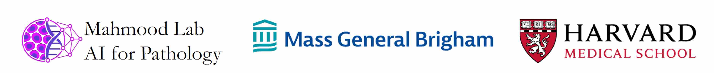

# Demographic bias in misdiagnosis by computational pathology models

*Nature Medicine* 

[Journal Link](https://doi.org/10.1038/s41591-024-02885-z) | [Cite](##Cite)

**Abstract:** Despite increasing numbers of regulatory approvals, deep learning-based computational pathology systems often overlook the impact of demographic factors on performance, potentially leading to biases. This concern is all the more important as computational pathology has leveraged large public datasets that underrepresent certain demographic groups. Using publicly available data from The Cancer Genome Atlas and the EBRAINS brain tumor atlas, as well as internal patient data, we show that whole-slide image classification models display marked performance disparities across different demographic groups when used to subtype breast and lung carcinomas and to predict _IDH1_ mutations in gliomas. For example, when using common modeling approaches, we observed performance gaps (in area under the receiver operating characteristic curve) between white and Black patients of 3.0% for breast cancer subtyping, 10.9% for lung cancer subtyping and 16.0% for *IDH1* mutation prediction in gliomas. We found that richer feature representations obtained from self-supervised vision foundation models reduce performance variations between groups. These representations provide improvements upon weaker models even when those weaker models are combined with state-of-the-art bias mitigation strategies and modeling choices. Nevertheless, self-supervised vision foundation models do not fully eliminate these discrepancies, highlighting the continuing need for bias mitigation efforts in computational pathology. Finally, we demonstrate that our results extend to other demographic factors beyond patient race. Given these findings, we encourage regulatory and policy agencies to integrate demographic-stratified evaluation into their assessment guidelines.


## Overview of repository
In our study we test multiple instance learning (MIL) algorithms on subtyping of breast and lung carcinomas and *IDH1* mutation prediction. For the subtyping tasks, we train models on The Cancer Genome Atlas (TCGA) and test on private in-house data collected at Mass General Brigham, Boston. For *IDH1* mutation prediction, we train on EBRAINS Brain Tumor Atlas and test on TCGA. Since the in-house data cannot be publicly shared, in this repo we provide the code to reproduce results on *IDH1* mutation prediction task, which is  based on publicly available datasets. Note that we combine TCGA-LUAD and TCGA-LUSC and often call it TCGA-LUNG. Similarly TCGA-GBM and TCGA-LGG are combined to called TCGA-GBMLGG. TCGA-BRCA and TCGA-Breast also refer to Breast invasive carcinoma cohort from TCGA.

## Installation Guide for Linux (using anaconda)
### Pre-requisities: 
- Linux (Tested on Ubuntu 18.04)
- NVIDIA GPU (Tested on Nvidia GeForce RTX 3090 Ti) with CUDA 11.7
- Python (version 3.8.13), PyTorch (version 2.0.0, CUDA 11.7), OpenSlide (version 4.3.1), openslide-python (version 1.2.0), Pillow (version 9.3.0), Scikit-learn (version 1.2.1), Matplotlib (version 3.7.1), Seaborn (version 0.12.2), Numpy (version 1.24.4), pandas (version 1.5.3), slideflow (version 2.1.0), smooth-topk.
- Code adapted from [CLAM](https://github.com/mahmoodlab/CLAM)

### Downloading TCGA and EBRAINS Brain Tumor Atlas Data
To download diagnostic WSIs (formatted as .svs files), molecular feature data and other clinical metadata, please refer  to the [NIH Genomic Data Commons Data Portal](https://portal.gdc.cancer.gov) and the [cBioPortal](https://www.cbioportal.org/). WSIs for each cancer type can be downloaded using the [GDC Data Transfer Tool](https://docs.gdc.cancer.gov/Data_Transfer_Tool/Users_Guide/Data_Download_and_Upload/). For EBRAINS Brain Tumor Atlas, data can be downloaded from [EBRAINS](https://search.kg.ebrains.eu/instances/Dataset/8fc108ab-e2b4-406f-8999-60269dc1f994). 

## Processing Whole Slide Images 
To process WSIs, first, the tissue regions in each biopsy slide are segmented using Otsu's Segmentation on a downsampled WSI using OpenSlide. Then, 256 x 256 patches without spatial overlapping are extracted from the segmented tissue regions at the desired magnification. We use three different feature encoders: $\text{ResNet50}$ trained on ImageNet ([ResNet50IN](https://github.com/mahmoodlab/CLAM)), Swin-T transformer trained on histology slides ([CTransPath](https://github.com/Xiyue-Wang/TransPath)), and a Vision Transformer Large trained on histology slides ([UNI](https://github.com/mahmoodlab/UNI)). We also extract Macenko stain normalized features using these feature extractors. We use the [CLAM](https://github.com/mahmoodlab/CLAM) toolkit to do all pre-processing.   

## Training-Validation splits on EBRAINS
20-fold label stratified Monte Carlo splits that have 90% data for training and 10% data for validation are provided for *IDH1* mutation prediction task using EBRAINS Brain Tumor Atlas. Splits are located in `splits_MonteCarlo`. Site stratified splits are not available for this task as tissue source site is not provided by EBRAINS, but nevertheless we provide them for breast and lung subtyping `splits_siteStratified`.  

## Exploring modeling techniques
We experiment with various modeling choices for all components of the typical computational pathology pipeline:
1. `Patch feature extractor:` We use ResNet50IN, CTransPath, and UNI
2. `Patch aggregators:` We use ABMIL, CLAM, and TransMIL 
3. `Bias mitigation strategies:` We investigate Importance Weighting and Adversarial Regularization. These techniques cannot be used for *IDH1* mutation prediction as patient race in EBRAINS is not provided.

You can find the model implementations in the `models` directory. 

## Running Experiments 
Once you have segmented tissue, created patches, and extracted the features, you can refer to `commands` folder to train and evaluate models. Hyper-parameters used to train these models are directly taken from their respective papers.

## Fairness criteria
To compare how well AI models work across demographic groups, we compare performance and fairness metrics. We use race-stratified area under the receiver operating characteristic curve (AUC) and F1 score score to measure performance across demographic groups. Under the Equalized Opportunity framework, we define True Positive Rate (TPR) disparity, which measure how well does the recall for a demographic subgroup conditioned on the subtype compares to the overall population's recall. You can find the code to calculate these metrics in the directory `analysis`. 

## Cite
If you find our work useful in your research or if you use parts of this code please consider citing our [paper](https://doi.org/10.1038/s41591-024-02885-z):

Vaidya, A., Chen, R.J., Williamson, D.F.K., et al. Demographic bias in misdiagnosis by computational pathology models. Nat Med (2024). [https://doi.org/10.1038/s41591-024-02885-z](https://doi.org/10.1038/s41591-024-02885-z)

```bibtext
@article{vaidya2024demographic,
  title={Demographic bias in misdiagnosis by computational pathology models},
  author={Vaidya, Anurag and Chen, Richard and Williamson, Drew and Song, Andrew and Jaume, Guillaume and Yang, Yuzhe and Hartvigsen, Thomas and Dyer, Emma and Lu, Ming and Lipkova, Jana and Shaban, Muhammad and Chen, Tiffany and Mahmood, Faisal},
  journal={Nature Medicine},
  publisher={Nature Publishing Group},
  year={2024}
}
```

## Issues 
- Please open new threads or report issues directly (for urgent blockers) to `avaidya@mit.edu`.
- Immediate response to minor issues may not be available.

## License and Usage 
[Mahmood Lab](https://faisal.ai) - This code is made available under the CC-BY-NC-ND 4.0 License and is available for non-commercial academic purposes.


